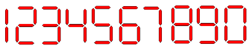

# LED

## Informações

- **Nível:** 3
- **Tipo:** Strings
- **Tempo Limite Base:** 1 Segundo(s)
- **Limite de Memória:** 200 MB
- **Feito por:** Autor Desconhecido

## Contexto

João quer montar um painel de leds contendo diversos números. Ele não possui muitos leds, e não tem certeza se conseguirá montar o número desejado. Considerando a configuração dos leds dos números abaixo, faça um algoritmo que ajude João a descobrir a quantidade de leds necessário para montar o valor.

Obs.: Para programadores de Javascript, recomenda-se o uso de "input.trim().split('\n')" para evitar erros conhecidos.

## Entrada

A entrada contém um inteiro N, (1 ≤ N ≤ 1000) correspondente ao número de casos de teste, seguido de N linhas, cada linha contendo um número (1 ≤ V ≤ 10100) correspondente ao valor que João quer montar com os leds.

## Saída

Para cada caso de teste, imprima uma linha contendo o número de leds que João precisa para montar o valor desejado, seguido da palavra "leds".

## Exemplo(s)

| Exemplos de Entrada                      | Exemplos de Saída                   |
| ---------------------------------------- | ----------------------------------- |
| 3   115380   2819311   23456 | 27 leds   29 leds   25 leds |
